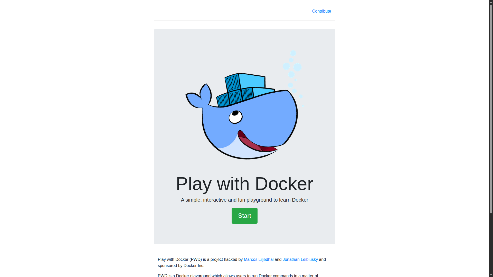
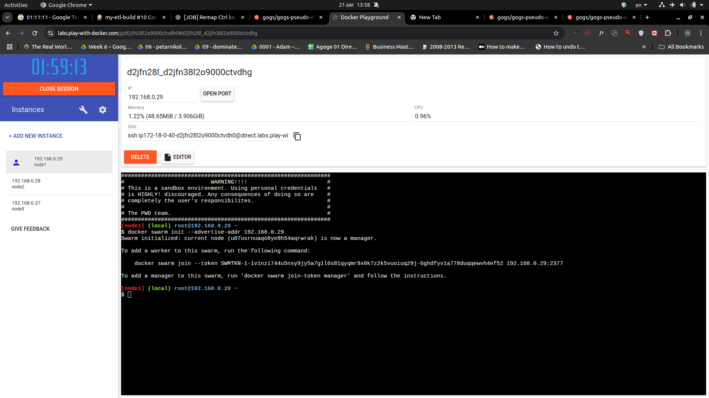
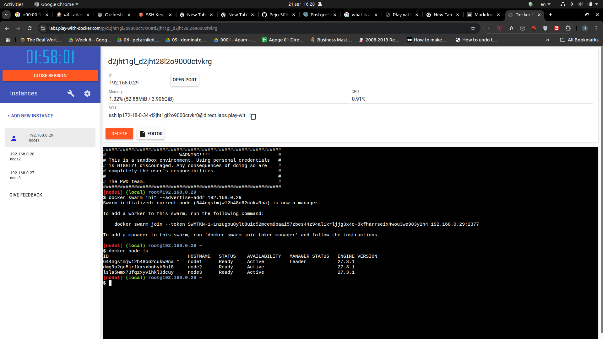
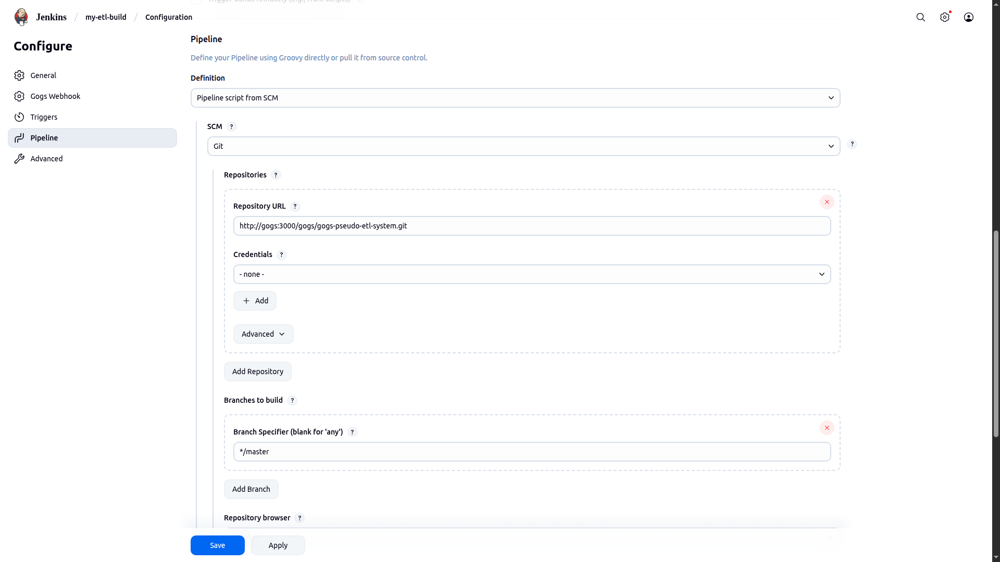
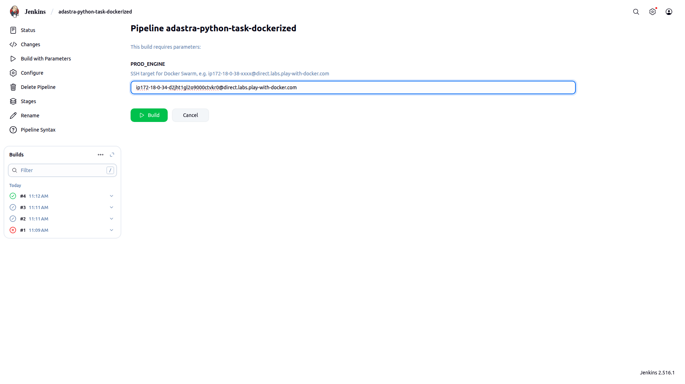
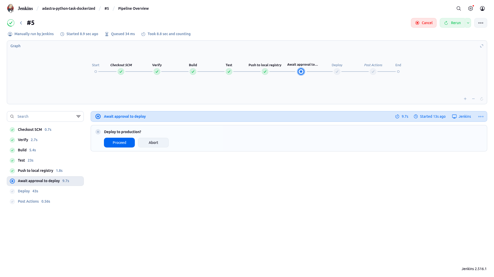

# Simple Pseudo ETL System - Dockerized

Local CI/CD pipeline for [Simple Pseudo ETL System](https://github.com/Pejo-306/adastra-python-task)
which packages the application in a Docker image and ships it to an external
Docker Swarm network. Developed as part of an internal training on Docker
during my junior position in **Adastra Bulgaria**.

## Table of Contents

* [Overview](#overview)
* [Setup](#setup)
  - [Prerequisites](#prerequisites)
  - [Clone Repository](#clone-repository)
  - [Deploy Local CI/CD Pipeline](#deploy-local-cicd-pipeline)
    * [Build Jenkins Image](#build-jenkins-image)
    * [Deploy Compose Application](#deploy-compose-application)
    * [Install Jenkins](#install-jenkins)
    * [Setup Gogs](#setup-gogs)
  - [Create Play-with-Docker External Docker Swarm](#create-play-with-docker-external-swarm)
  - [Deploy Application](#deploy-application)
    * [Upload codebase to Gogs](#upload-codebase-to-gogs)
    * [Create Pipeline Job](#create-pipeline-job)
    * [Run Jenkins Pipeline](#run-jenkins-pipeline)
* [Explore Orchestration](#explore-orchestration)
* [Built with](#built-with)
* [License](#license)

## Overview

The goal of this project is to streamline the software development process of the
application [Simple Pseudo ETL System](https://github.com/Pejo-306/adastra-python-task)
via a CI/CD pipeline. The pipeline streamlines development by automatically 
pulling developer changes, testing application, and deploying updates to a production
environment (in this case - a small Docker Swarm).

The specifics of the deployed application isn't explored in this README. See
[Simple Pseudo ETL System](https://github.com/Pejo-306/adastra-python-task) for
more details. The application will be viewed as a black box.

This project's CI/CD pipeline is deployed on a local Docker engine and consists of:

- A local registry to store the application's image
- A centralized **Gogs** repository
- A **Jenkins** pipeline
- Internal overlay network and **PostgreSQL** database (used by **Gogs**)

The CI/CD pipeline consists of 6 stages:

1) Checkout newest code changes from centralized **Gogs** repository
2) Verify system can execute CI/CD pipeline
3) Build application's image
4) Test application's image (If the test is unsuccessful, the pipeline stops)
5) Push application's image to local registry
6) Deploy application to external Docker Swarm stack

On success, the pipeline results in an updated external Docker Swarm stack with
the latest application version running.

## Setup

This section contains detailed instructions on how to deploy the
application from local code to production Docker Swarm stack over the CI/CD pipeline.

### Prerequisites

- **Docker** version **28.1+**
- **docker-compose** version **1.27+**

### Clone Repository

Clone the repo:
```bash
git clone https://github.com/Pejo-306/adastra-python-task-dockerized
cd adastra-python-task-dockerized/
```

### Deploy Local CI/CD Pipeline

#### Build Jenkins Image

First step: build custom Jenkins image with ability to deploy Docker Swarm stack
over SSH:

```bash
docker-compose -f CICD/docker-compose.yml build
```

The custom Jenkins image does 3 notable things:
- Installs **Docker** and **docker-compose** inside the Jenkins container
- Resolves **direct.labs.play-with-docker.com** as a known SSH host
- Generates a pair of **ED25519 SSH keys** and displays the public key

You should spot a public SSH key in the terminal output, e.g.:
```bash
===== BEGIN id_ed25519.pub (PUBLIC) =====
ssh-ed25519 AAAAC3NzaC1lZDI1NTE5AAAAIKmylXbnekdfX+DyWR2daduYQjtuMAZzfsPDSwIqANDP root@ad08a9b2eaf7
+ echo ===== END id_ed25519.pub (PUBLIC) =====
===== END id_ed25519.pub (PUBLIC) =====
```

**IMPORTANT**: Copy the public SSH key and store it somewhere. It will be needed
later to [Configure SSH Accesses](#configure-ssh-accesses) between the local CI/CD
Jenkins pipeline and the external Docker Swarm network on Play with Docker.

#### Deploy Compose Application

Deploy the full CI/CD pipeline on your local Docker engine:

```bash
docker-compose -f CICD/docker-compose.yml up
```

If everything is successful, you should see multiple containers spawned and attached
to a network like so:

```bash
Creating network "cicd_infrastructure-net" with the default driver
Creating cicd_local-registry_1    ... done
Creating cicd_infrastructure-db_1 ... done
Creating cicd_jenkins_1           ... done
Creating cicd_gogs_1              ... done
Attaching to cicd_infrastructure-db_1, cicd_jenkins_1, cicd_local-registry_1, cicd_gogs_1
```

Containers will begin login to your bash terminal. Scroll down until you find
the automatically generated Jenkins password:

```bash
jenkins_1            | *************************************************************
jenkins_1            | *************************************************************
jenkins_1            | *************************************************************
jenkins_1            | 
jenkins_1            | Jenkins initial setup is required. An admin user has been created and a password generated.
jenkins_1            | Please use the following password to proceed to installation:
jenkins_1            | 
jenkins_1            | 7b6ba956c4504d9dadf22495b5b000de
jenkins_1            | 
jenkins_1            | This may also be found at: /var/jenkins_home/secrets/initialAdminPassword
jenkins_1            | 
jenkins_1            | *************************************************************
jenkins_1            | *************************************************************
jenkins_1            | *************************************************************
```

**IMPORTANT**: Copy the administrator password and use it to [install Jenkins](#install-jenkins).

#### Install Jenkins

**NOTE**: Since application interfaces change rapidly, no screenshots are provided
in this section. The goal is to access the Jenkins setup wizard and follow along until
Jenkins is installed.

Access **[localhost:8088](http://localhost:8088)**.

*(Screen 1)* A setup wizard will open requesting administrator login. Input the
administrator password copied after [deploying the compose application](#deploy-compose-application).

*(Screen 2)* Select "Install suggested plugins".

*(Screen 3)* Wait for the setup wizard to install Jenkins.

*(Screen 4)* Create an admin account. Recommended to use the following credentials:

| Credential | Description            | Value                | Required |
|------------|------------------------|----------------------|----------|
| `username` | Your login username    | `jenkins`            | ✅       |
| `password` | Your login password    | `jenkins`            | ✅       |
| `full name`| Your full name         | `jenkins`            | ✅       |
| `email`    | Your email address     | `jenkins@example.com`| ✅       |

*(Screen 5)* Set Jenkins URL to:
```bash
http://localhost:8088/
```

Complete installation. You should have access to the Jenkins dashboard.

#### Setup Gogs

**NOTE**: Since application interfaces change rapidly, no screenshots are provided
in this section. The goal is to access the Gogs setup wizard and follow along until
Gogs is installed.

Access **[localhost:8081](http://localhost:8081)**.

A setup wizard will open with 3 sections requesting values to
setup the database connection, configure general application settings, and
create an admin account. Use these values exactly:

**Database Settings**


| Setting         | Description             | Value                    |
|-----------------|-------------------------|--------------------------|
| `Database Type` | Type of database        | `PostgreSQL`             | 
| `Host`          | Host domain and port    | `infrastructure-db:5432` |
| `User`          | Database admin user     | `postgres`               |
| `Password`      | Database admin password | `postgres`               |
| `Database Name` | Database name           | `postgres`               |
| `Schema`        | Database schema         | `public` (default)       |
| `SSL Mode`      | Connection method       | `Disable` (default)      |


**Application General Settings**


| Setting                  | Description                           | Value                                   |
|--------------------------|---------------------------------------|-----------------------------------------|
| `Application Name`       | Application name                      | `Gogs`                                  | 
| `Repository Root Path`   | Directory to save remote repositories | `/data/git/gogs-repositories` (default) |
| `Run User`               | Default Git user                      | `git`                                   |
| `Domain`                 | Domain                                | `localhost`                             |
| `SSH Port`               | Port number of SSH server             | `22`                                    |
| `Use Builtin SSH Server` | Use Gog's SSH server                  | `<leave unchecked>` (default)           |
| `HTTP Port`              | Port number to listen to              | `3000`                                  |
| `Application URL`        | Publicly accessible URL               | `http://localhost:8081/`                |
| `Log Path`               | Directory to write log files          | `/app/gogs/log`                         |
| `Enable Console Mode`    | Write logs to console                 | `<leave unchecked>` (default)           |
| `Default Branch`         | Primary branch to initialize repos    | `master` or 'main'                      |


**Admin Account Settings (under Optional Settings)**


| Setting      | Description            | Value              |
|--------------|------------------------|--------------------|
| `Username`   | Admin account username | `gogs`             | 
| `Password`   | Admin account password | `gogs`             |
| `Admin Email`| Admin account email    | `gogs@example.com` |


After Gogs is successfully installed, go ahead and create a repository named `gogs-pseudo-etl-system`.
This will be your centralized code repository.

**OPTIONAL AND RECOMMENDED**: Go into your Gogs's account settings and add your
local machine's public SSH key. You will be able to push the application's code over SSH.
No instructions are provided in this README.

### Create Play-with-Docker External Docker Swarm

In this section we setup an external Docker Swarm on Play with Docker.

1) Open **[Play with Docker](https://labs.play-with-docker.com/)**, login, and click "Start".



2) Add the first node by clicking `+ ADD NEW INSTANCE`.

3) We will use the first node as a Docker Swarm manager. Initialize Docker Swarm
by advertising the node's IP address (seen in the bash terminal), e.g.:

```bash
docker swarm init --advertise-addr 192.168.0.XX
```



4) The manager will print a message with a docker command which allows other nodes to join
the swarm. Go ahead and create 2-3 more nodes with `+ ADD NEW INSTANCE`. In each node's
bash terminal join the swarm by pasting the given joining command:

```bash
docker swarm join --token <long token> 192.168.0.XX:2377
```

You should see confirmation from each worker node saying:

```bash
This node joined a swarm as a worker.
```

5) Go back to the manager node and confirm the swarm nodes are connected:

```bash
docker node ls
```

You should see one Leader node and multiple workers like so:




6) **IMPORTANT**: Add Jenkins's container's public SSH key to the Docker Swarm manager.
Use your public SSH key at the end of [building the Jenkins image](#build-jenkins-image):

```bash
echo "<your Jenkins's container's public SSH key>" >> ~/.ssh/authorized_keys
```

And confirm the key is there:

```bash
cat ~/.ssh/authorized_keys
```

Without this step, Jenkins won't be authorized to deploy the application to the
remote Docker Swarm.

7) Take note of the ssh command which display's the node's external SSH access domain:

```bash
ssh ip172-18-0-34-d2jht1gl2o9000ctvkr0@direct.labs.play-with-docker.com
```

We will need this domain in place of `PROD_ENGINE` when [running the pipeline](#run-jenkins-pipeline).

### Deploy Application

At this point, we are ready to upload the application on the centralized Gogs
repository and deploy it to Play with Docker's remote Docker Swarm via our
Jenkins CI/CD pipeline.

#### Upload Codebase to Gogs

Add Gogs repository to your local git repository's remotes. 

```bash
git remote add gogs git@localhost:gogs/gogs-pseudo-etl-system.git
```

Push your local repository to Gogs:

```bash
git push gogs master
```

#### Create Pipeline Job

Access **[localhost:8088](http://localhost:8088)** and click "+ New Item"

*(Screen 1)*
- Enter `adastra-python-task-dockerized` as the item name
- Select "Pipeline"
- Click "Ok" button

*(Screen 2)* under "Pipeline" options:
- Change Definition to "Pipeline script from SCM"
- Change SCM to "Git"
- Add the URL `http://gogs:3000/gogs/gogs-pseudo-etl-system.git` as Repository URL
- Leave Branch Specifier as `*/master`
- Leave Script Path as `Jenkinsfile`
- Click the blue "Save" button



#### Run Jenkins Pipeline

On the pipeline screen, click "Build with Parameters".

It will prompt you to add the parameter `PROD_ENGINE` which specifies the domain name
of the external Docker Swarm. Input the domain name **without the ssh command**
we got on step 7 of [Create Play-with-Docker External Docker Swarm](#create-play-with-docker-external-swarm):



Click the green "Build" button.

Then select the latest build # in the box on the left. It will open the current
build's overview. Click "Pipeline Overview" to view the pipeline in action:



It will ask you to manually confirm deployment to production (Play with Docker's Docker Swarm).
Click "Proceed".

If all is successful the pipeline overview should display green on all stages.

Play with Docker's remote Docker Swarm is now running the application
[Simple Pseudo ETL System](https://github.com/Pejo-306/adastra-python-task)...

## Explore Orchestration

Now that we have a running application on Play with Docker's Docker Swarm, we
are free to explore it working in real time.

First, display the application's Docker stack:

```bash
docker stack ls
```

It will display a stack named `aptd-prod` with 3 services. Let's take a look at
the services:

```bash
docker stack services aptd-prod
```

Output:
```
ID             NAME                         MODE         REPLICAS   IMAGE                                               PORTS
tsjrxp07jzn7   aptd-prod_aptd               replicated   5/5        penikolov23/adastra-python-task-dockerized:latest   
aimnkh0rrjp0   aptd-prod_aptd-postgresink   replicated   2/2        penikolov23/adastra-python-task-dockerized:latest   
mrwhey5kw0v0   aptd-prod_postgres-db        replicated   1/1        postgres:latest                                     
```

We have 3 services running:
- *aptd-prod_postgres-db*: application's PostgreSQL database for PostgresSink ETL jobs
- *aptd-prod_aptd*: 5 replicas of application running with SimulationSource and ConsoleSink.
  It generates infinite dummy data and sinks it in it's own console.
- *aptd-prod_aptd-postgresink*: 2 replicas of application running with PostgresSink
  It dumps it's source data to the PostgreSQL service *aptd-prod_postgres-db*

Let's inspect logs of the *aptd-prod_aptd* service:

```bash
docker service logs aptd-prod_aptd
```

We get exactly what we'd expect - an infinite stream of random data dumped to the console:

```
...
aptd-prod_aptd.2.0etwxmnx4mxt@node2    | (prod console)::key:A839 | value:13.306276334225842 | ts:1580-02-20 03:12:02.092112-00:16
aptd-prod_aptd.2.0etwxmnx4mxt@node2    | (prod console)::key:T557 | value:61.329585790009254 | ts:1924-08-09 12:47:19.635584-04:00
aptd-prod_aptd.5.erc364iqllu3@node2    | (prod console)::key:T509 | value:26.330688864466445 | ts:0377-12-27 03:11:16.758124-05:47
...
```

Note how data is being dumped concurrently by different replicas of the service.

Feel free to explore the application on your own...

## Built with

* [Simple Pseudo ETL System](https://github.com/Pejo-306/adastra-python-task)
* [Docker](https://www.docker.com/) and [Docker Compose](https://github.com/docker/compose)
* [Play with Docker](https://labs.play-with-docker.com/)
* [Gogs](https://gogs.io/)
* [Jenkins](https://www.jenkins.io/)
* [PostgreSQL](https://www.postgresql.org/)

## License

This project is distributed under the [MIT license](LICENSE).


